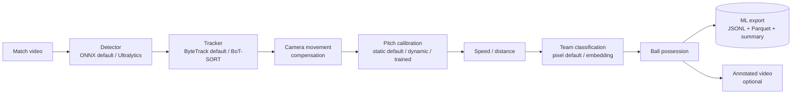

# Agon

*Agon* (ἀγών) — Greek for "contest" or "competition."

[](https://github.com/bradpatton/agon/actions/workflows/ci.yml)
[](LICENSE)
[](pyproject.toml)

Turns soccer match footage into structured, ML-ready tracking data: per-frame
player/referee/ball positions (pixel *and* pitch-space meters), team
assignment, ball possession, and speed/distance — exported as JSONL and
Parquet, not just an annotated video. An annotated video is still available
as an optional output, but the data is the point.

## What it does



Every stage marked "default / alternative" is swappable via config, behind a
`typing.Protocol` interface (see `src/agon/interfaces.py`) — no
pipeline code changes needed to pick a different backend. See
[Modernization & backend options](#modernization--backend-options) below for
what each alternative actually buys you and its real limitations.

## Install

```bash
git clone https://github.com/bradpatton/agon.git
cd agon
uv sync            # or: pip install -e .
```

Extras (none required for the default pipeline):

| Extra | Adds | Needed for |
|---|---|---|
| `[train]` | `torch`, `ultralytics`, `boxmot` | `UltralyticsDetector`, `BoTSORTTracker`, fine-tuning a checkpoint |
| `[assets]` | `gdown` | `scripts/download_assets.py` |
| `[dev]` | `pytest`, `ruff`, `mypy`, `pre-commit` | running tests/lint locally |

`torch` is deliberately not a core dependency — the default detector
(`OnnxDetector`, via `onnxruntime`) doesn't need it, and current `torch`
releases don't ship wheels for every platform (confirmed on Intel macOS
while building this). See [Modernization](#modernization--backend-options).

## Quickstart

```bash
# Fetch the tutorial's demo checkpoint + sample clip (or supply your own).
python scripts/download_assets.py

# The default backend runs on ONNX; export the downloaded .pt checkpoint once
# (needs the [train] extra just for this one-time conversion):
python -c "from ultralytics import YOLO; YOLO('models/best.pt').export(format='onnx', imgsz=640, dynamic=False)"

agon \
  --input input_videos/08fd33_4.mp4 \
  --model models/best.onnx \
  --calibration configs/calibration/example_pitch.json \
  --format jsonl --format parquet --format summary
```

Outputs land in `output/` by default (`--output-dir` to change it):
`<video>_frames.jsonl`, `<video>_frames.parquet`, `<video>_summary.json`. Add
`--format video` for an annotated `.mp4` alongside the data, `--format
schema` to also dump the JSON Schema. `--help` lists everything, including
`--cache` to reuse tracking results between runs while iterating.

`configs/calibration/example_pitch.json` is calibrated to the tutorial's one
sample camera angle — see [Pitch calibration](#pitch-calibration) before
pointing it at different footage.

## Output data schema

One record per frame, `schema_version`-stamped for forward compatibility
(`src/agon/export/schema.py` is the source of truth; a JSON
Schema is published via `--format schema`):

```json
{
  "schema_version": "1.0.0",
  "video_id": "08fd33_4",
  "frame_id": 142,
  "timestamp_s": 5.92,
  "camera_movement_px": [3.1, -0.4],
  "team_ball_control": 1,
  "objects": [
    {
      "track_id": 7,
      "class": "player",
      "team": 1,
      "bbox_px": [812.3, 401.1, 861.7, 512.4],
      "position_px": [837.0, 512.4],
      "position_pitch_m": [34.2, 12.8],
      "speed_kmh": 24.1,
      "distance_m": 812.4,
      "has_ball": true
    }
  ],
  "camera_pose": {
    "pan_degrees": 22.8,
    "tilt_degrees": -103.5,
    "roll_degrees": -0.3,
    "position_m": [10.2, -58.4, -21.1],
    "x_focal_length_px": 3203.4,
    "y_focal_length_px": 3203.4
  }
}
```

`class` is one of `player` / `goalkeeper` / `referee` / `ball`.
`position_pitch_m` is `null` when the point falls outside the calibrated
pitch area, or when the active `PitchCalibrator` had no usable reference in
that frame (see [Pitch calibration](#pitch-calibration)) — this is a real
"we don't know" signal, not a bug, and downstream ML code should treat it
that way rather than imputing a value. `camera_pose` is `null` unless the
active calibrator resolved a real per-frame homography for that frame (see
[Pitch calibration](#pitch-calibration)) — today, only `calibration_mode:
trained` (directly or wrapped in `hybrid`) can produce one; every other
frame/calibrator combination is `null`. `<video>_summary.json` has
match-level aggregates (possession %, per-player total distance / avg / max
speed) built from the same data.

## Modernization & backend options

This started from a well-known YOLO+ByteTrack tutorial. Every algorithmic
choice was re-evaluated against current practice; some were upgraded, one
turned out to be a real accuracy bug rather than just dated. Priority order
below reflects how much each one matters, not the order they were built in.

### Pitch calibration

The highest-priority item, because it isn't just a modernization nice-to-have
— **a single static homography for an entire match is a real accuracy bug**.
Broadcast cameras pan/zoom continuously; the optical-flow camera-movement
compensation only corrects translation, not zoom/rotation, so pitch-space
positions silently drift wrong for most of the footage under `calibration_mode:
static` (the default, `ViewTransformer`).

`calibration_mode: dynamic` (`PitchKeypointCalibrator`) is a classical-CV
first cut at fixing this per-frame: it detects the pitch's center circle each
frame (its real-world 9.15m radius gives scale + position) and the halfway
line's angle (gives rotation). It is **not** a trained keypoint model and
**not** a full projective homography — read
`src/agon/geometry/pitch_keypoint_calibrator.py`'s module
docstring before trusting its output for anything beyond relative
speed/distance. It returns `null` positions for frames where it can't find
the circle (most of a real match), same as the static calibrator does
outside its polygon.

`calibration_mode: trained` (`TrainedPitchCalibrator`) uses a real trained
pose-estimation model (38 canonical pitch keypoints — line/box/goal-post
endpoints; `scripts/train_pitch_calibration.py`, pose mAP50 0.842 on
held-out data) and solves a genuine projective homography (`cv2.findHomography`
with RANSAC) from however many of those 38 points a frame actually shows,
not just the center circle. Requires `pitch_calibration_model_path`. Real,
measured tradeoff, not a strict upgrade over `dynamic`: on a typical wide
match-broadcast sample it covered 92.5% of frames (vs. 13.7% for `dynamic`
on the same window) and — because it's a real homography, not a similarity
transform — 100% of those resolved frames also produced a full camera pose
(pan/tilt/roll/focal length, see `agon.geometry.camera_pose` below) with
smooth, physically-plausible values frame to frame. But on a tight
center-circle-only shot with few other line features visible, its coverage
was *lower* than `dynamic`'s (13.3% vs. 62.8%) — the two calibrators'
strengths are framing-dependent, see
`scripts/validate_trained_pitch_calibrator.py`. `calibration_mode: "hybrid"`
+ `pitch_calibration_model_path` together become a 3-way chain (trained →
dynamic → static, `HybridPitchCalibrator` nested with no new code) rather
than the plain 2-way dynamic/static chain — trained tried first given its
much higher typical-footage coverage, with the other two as real fallbacks
for the framing it doesn't win on.

**Critical correction: coverage is not accuracy, and a real ground-truth
check found the accuracy isn't there yet.** Every number above measures
whether `trained` *produces* a position, not whether that position is
*correct*. `agon.geometry.trained_pitch_calibrator.leave_one_out_position_errors`
is this project's first real ground-truth accuracy check: for each
detected keypoint in a frame, fit a homography from every *other*
detected keypoint (exactly as a real player position estimate would be),
then measure how far the held-out keypoint's predicted position lands
from its independently known true position (FIFA pitch dimensions).
**Real result** (`scripts/measure_position_accuracy.py`, 425 real
frames, 5,950 measurements): **median error 16.7m, mean 13.7m, p90
29.7m** — not accurate, and not explained by too few or too clustered
keypoints (the best-observed case — 14 keypoints spread across nearly
the full frame — gave essentially the same ~16.6m error). Likely cause:
the training metric (pose mAP50) measures whether a keypoint was
detected, not how precisely it was localized. **Do not treat
`calibration_mode: "trained"` (or `"hybrid"` wrapping it) as accurate
for absolute position today** — high coverage, not verified correctness.

`agon.geometry.camera_pose` (`camera_pose_from_homography`): given a real
projective homography, recovers full camera pose — pan/tilt/roll/3D
position/focal length, not just a flat pixel↔pitch mapping. A cited port of
SoccerNet's own `sn-calibration` baseline (itself implementing a
single-view self-calibration algorithm from Hartley & Zisserman's
*Multiple View Geometry*). Validated synthetically to sub-millipixel
reprojection accuracy, and against real footage via `TrainedPitchCalibrator`
above (225/225 resolved frames decomposed successfully on one real sample).
**Real bug found and fixed while building ball-height estimation** (see
below): a homography is only defined up to overall scale, so `H` and `-H`
decompose to two candidate cameras — one real, one its mirror image below
the pitch — and the code picked one arbitrarily. Confirmed on real data (a
well-fit homography decomposed to a camera 14.8m *below* ground) and fixed
by keeping whichever candidate has the camera above the pitch. The
decomposition-success rate is unchanged (still 100% on the same sample),
but a real, important lesson surfaced with it: temporal smoothness alone
can't validate absolute pose correctness — a consistently-wrong pose is
just as smooth as a correct one.
Only usable against `calibration_mode: trained`'s output today (directly,
or wrapped in `hybrid`) —
`PitchKeypointCalibrator`'s similarity-transform homography structurally
lacks the perspective information this needs (confirmed empirically, not
assumed — see that module's own docstring), and `ViewTransformer`'s static
homography is real but typically uncalibrated in practice. Wired into the
export schema (`FrameRecord.camera_pose`) — populated whenever the active
calibrator resolved a real per-frame homography for that frame, null
otherwise.

### Team classification

`team_classifier: pixel` (default, `TeamAssigner`) clusters raw jersey-crop
pixel colors — fragile under similar kit colors, lighting, and motion blur.
`team_classifier: embedding` (`EmbeddingTeamClassifier`) clusters small-CNN
embeddings instead (a MobileNetV3-Small backbone exported to ONNX via
`scripts/export_team_embedding_model.py`), which holds up meaningfully
better. Neither can separate "team" from "referee" without a soccer-specific
detector checkpoint with its own referee class.

### Tracking

`tracker_backend: bytetrack` (default, via `supervision`) is solid.
`tracker_backend: botsort` (`BoTSORTTracker`, via `boxmot`) adds a better
motion model and optional camera-motion compensation, at the cost of needing
the `[train]` extra — `boxmot` imports `torch` unconditionally, even in
motion-only mode (confirmed, not assumed).

### Inference backend

`OnnxDetector` (default, `onnxruntime`) vs. `UltralyticsDetector`
(`torch`/`ultralytics`, needs `[train]`). `torch` is unavoidable for
training/fine-tuning a checkpoint, but it's the wrong default dependency for
inference: it's heavy, and current releases don't have wheels for every
platform. `onnxruntime` is what Ultralytics itself recommends for
deployment. Export any checkpoint with `model.export(format="onnx",
imgsz=640, dynamic=False)`.

### Not yet done

- **Action/event recognition** (pass, shot, tackle). The export schema's
  `class` field and per-object structure are designed to extend to this
  later without a breaking change, but nothing is implemented yet. SoccerNet
  Action Spotting is the reference benchmark to build toward.
- **Ball speed/distance — not computed at all.** `SpeedDistanceEstimator`
  explicitly excludes the ball (`_EXCLUDED_OBJECT_TYPES = {"ball",
  "referees"}`), asserted as intended behavior in its own test. The ball
  is tracked (a bbox per frame exists), it's just never run through the
  same kinematics players get. Straightforward to add, but its output
  would inherit the same position-accuracy caveat above until that's
  addressed.
- **Player position accuracy — see the critical correction in "Pitch
  calibration" above.** Real ground-truth validation found a median
  16.7m position error for `calibration_mode: "trained"` on real
  footage, despite 92.5% coverage. Not currently accurate enough to
  trust for absolute position. **Root cause of one contributing factor
  (six-yard-box keypoint confusion) isolated**: confirmed a genuine model
  generalization gap, not a training-data bug — the raw SoccerNet
  training labels correctly distinguish the six-yard box from the
  penalty box; the trained model just fails to preserve that distinction
  on this project's real target broadcast footage. `scripts/
  annotate_ground_truth.py` (interactive click tool, run locally) +
  `scripts/measure_ground_truth_accuracy.py` (direct pixel-error
  comparison, no homography/FIFA-dimension assumption) give this project
  its first footage-specific, human-verified ground truth. **First real
  result**: 2 annotated frames of `benchmark_clip.mp4` (a tight
  center-circle shot, this model's known worst-case framing) — 70 of 76
  annotated keypoints (92%) got no confident model prediction at all,
  and the 6 it did predict were off by a median of 720px (max 1444px)
  on a 1916×1080 frame. The most direct accuracy signal this project has
  produced yet, and worse than every indirect proxy measured so far —
  though from only 2 frames in the model's worst-case framing, so not
  yet a general conclusion. Next: annotate a wide-shot clip (92.5%
  measured coverage) to see if this holds outside that worst case.
- **Ball height (Z) — attempted, math validated, real-footage accuracy not
  trustworthy yet.** `agon.geometry.camera_pose.pixel_to_ray` +
  `agon.analytics.ball_height.estimate_ball_position_3d` (classical
  similar-triangles monocular depth from the ball's known ~22cm real size)
  are built and validated to sub-millimeter accuracy synthetically. Real
  footage (`scripts/validate_ball_height.py`) gave 15-26m estimated
  heights on open play (should be near 0) — checked, not assumed, that
  this doesn't correlate with detection confidence, and the recovered
  camera height itself is stable frame-to-frame, ruling out simple
  detection noise or pose jitter. Most likely explanation: on-plane (z=0)
  homography accuracy doesn't guarantee the full 3D pose decomposition is
  accurate enough for off-plane extrapolation over tens of meters at a
  shallow broadcast-camera angle — a concrete consequence of
  `camera_pose_from_homography`'s already-documented noise sensitivity.
  This project has no ground-truth calibration file to isolate the cause
  further. Not wired into the pipeline or export — shipped as a validated
  building block, not a production-ready feature.
- **Trained pitch calibration is now fully wired: export field, and a 3-way
  hybrid chain.** `calibration_mode: trained`, `agon.geometry.camera_pose`,
  `FrameRecord.camera_pose` (pan/tilt/roll/position/focal length, populated
  whenever the active calibrator resolved a real per-frame homography for
  that frame — see the "Pitch calibration" section above for the coverage
  numbers), and `calibration_mode: "hybrid"` + `pitch_calibration_model_path`
  together (trained → dynamic → static, `HybridPitchCalibrator` nested with
  no new code) are all real, built, tested, and validated. `trained` isn't
  the pipeline's *default* — it needs a checkpoint most users won't have,
  and its coverage is framing-dependent (see above) — but every piece is in
  place for anyone who has one.
- **Jersey number recognition now uses OCR (EasyOCR), not a trained
  classifier — the classifier is kept but discouraged.** The original
  approach (`agon.jersey.OnnxJerseyClassifier`, a classifier trained on
  SoccerNet crops) was root-caused to a real, confirmed data problem:
  SN-GSR-2025's jersey label is assigned per *track*, not per frame, so a
  large fraction of training crops show no visible number at all while
  being confidently labeled with a real digit anyway. Its training-time
  validation accuracy (2.4% top1) was actually *worse* than trivially
  guessing the most common class (16.4%) — see CHANGELOG for the full
  diagnosis. `agon.jersey.ocr_reader.EasyOcrJerseyReader` replaces it: a
  pretrained, general-purpose text reader, no training on this project's
  noisy labels at all. Validated against real crops: 93-100% confidence
  on clearly-visible numbers, correctly abstains when the number isn't
  visible — but real misreads do still happen even at high confidence
  (a 93%-confidence 36→35 misread was found), so
  `agon.jersey.aggregator` now also requires several frames to agree
  (`jersey_min_votes`, default 2) before trusting a track's answer, not
  just one confident read. `PipelineConfig.jersey_backend` selects
  `"off"` (default) / `"ocr"` (recommended) / `"onnx"` (the old
  classifier). Needs the `[train]` extra (`easyocr` pulls in torch).
  Real before/after: the specific real player the old classifier
  confidently mislabeled #36 (actually wearing #12) now correctly comes
  out as **12** after re-running the full pipeline end-to-end with the
  OCR backend — confirmed against the same track, same crop.
- **Pitch-position coverage improved with a new hybrid calibrator, but
  absolute accuracy is still unverified against real ground truth.**
  `calibration_mode: "hybrid"` (`agon.geometry.HybridPitchCalibrator`)
  tries the dynamic per-frame calibrator first and falls back to the
  static one per point — measured at 77.0% pitch-position coverage on a
  real clip, vs. 34.4%/56.9% for static/dynamic alone (still `"static"`
  by default; `"hybrid"` needs a calibration file too, for the fallback).
  Separately, `scripts/measure_pitch_calibration_agreement.py`
  cross-checks the two calibrators against each other and found a mean
  65.79m disagreement on the same clip — but that clip's calibration
  file is explicitly self-documented as "uncalibrated/approximate," so
  this doesn't cleanly indict either calibrator's real accuracy, and
  surfaced a genuine gap: **this project has no properly-annotated pitch
  calibration file anywhere** to measure true accuracy against. See
  CHANGELOG and the project plan's Phase 12 for the fuller prioritized
  list of remaining improvements (a full multi-point homography instead
  of the dynamic calibrator's similarity-transform approximation,
  camera-motion-compensated carry-forward, a real
  known-pitch-dimension accuracy harness, and the already-planned trained
  keypoint model) — none of those four are built yet.

## Training / fine-tuning

Fine-tuning the detector (and jersey number classifier) on real SoccerNet
data — deploying the `agon:train` Docker image to a separate GPU
machine, since training is CPU-impractical — is covered in
**[`docs/TRAINING.md`](docs/TRAINING.md)**, a quick copy-paste-able guide,
not this README. Short version: no GPU is needed to *develop against* this
project (this repo was built entirely without one), but a real training run
needs one; `docs/TRAINING.md` covers building the image, verifying the GPU
is actually visible before trusting anything else, pulling and preparing
the data, training, and deploying the resulting checkpoint back into the
main pipeline.

Training data comes from three combined SoccerNet sources, pulled and
converted by one command (`scripts/prepare_training_data.py`): **SN-GSR-2025**
(HuggingFace, no NDA — detection boxes, jersey numbers, pitch lines from a
curated game subset), and two legacy OwnCloud-hosted datasets that download
with SoccerNet's generic public password rather than an NDA-gated one —
**Calibration** (standalone pitch-line-annotated images, broader scene
diversity than GSR's video sequences) and **Jersey-2023** (richer,
tracklet-based jersey number data). All three land in the same output
directories regardless of source, so `train_detector.py` and
`train_jersey_classifier.py` need no changes to use them together.

## Configuration

`configs/default.yaml` sets `PipelineConfig` defaults (detection confidence,
speed-window size, `calibration_mode`, `team_classifier`, `tracker_backend`,
inference device, ...) — override with `--config your.yaml` or
`AGON_PIPELINE__<FIELD>` env vars. `configs/calibration/*.json` is
per-video/per-camera-angle: four pixel corner points + real pitch dimensions
(see `configs/calibration/example_pitch.json`'s comments for how to build
one for new footage).

## Development

```bash
uv sync --extra dev
pytest                              # 193 tests, pure logic + synthetic inputs, no video/model needed
ruff check src/ tests/ && ruff format --check src/ tests/
mypy src/agon
pre-commit install                  # run the above automatically on commit
```

The `[train]`-extra-dependent backends (`UltralyticsDetector`,
`BoTSORTTracker`) can't be exercised on every platform (see above) — the
`Dockerfile` exists specifically to validate them in a consistent Linux
environment:

```bash
docker build -t agon:train .
docker run --rm -v "$(pwd)/input_videos:/data/input_videos:ro" \
  -v "$(pwd)/models:/data/models:ro" -v "$(pwd)/configs:/data/configs:ro" \
  -v "$(pwd)/output:/data/output" -w /data agon:train \
  agon --input input_videos/your_clip.mp4 --model models/best.pt \
  --calibration configs/calibration/your_calibration.json
```

## Repo layout

```
src/agon/
  cli.py, pipeline.py       # entry point + orchestration
  detection/                # Detector backends + tracking assembly
  camera/                   # optical-flow camera-movement compensation
  geometry/                 # bbox math, pitch calibrators
  team/                     # team classifiers
  jersey/                   # jersey-number classifier + track-level aggregation
  analytics/                # ball possession, speed/distance
  export/                   # versioned schema + JSONL/Parquet/summary writers
  viz/                      # annotated-video drawing
configs/                    # pipeline defaults + per-video pitch calibration
scripts/                    # asset download, team-embedding model export,
                             # SoccerNet download/convert/train (see docs/TRAINING.md)
notebooks/                  # training/exploration notebooks (not part of the pipeline)
tests/
```

## License & credits

MIT — see [LICENSE](LICENSE). This project restructures, hardens, and
extends a well-known public YOLO + ByteTrack + KMeans soccer-analysis
tutorial (detection/tracking/team-color/camera-compensation/homography/
speed-distance pipeline). If you recognize the original author or source
repo, please open a PR to add proper attribution here — it wasn't included
in the material this project started from.

If you use `scripts/download_assets.py`, note it fetches a third-party
checkpoint and sample clip from the original tutorial's hosting; verify
their license/provenance is appropriate for your use before relying on them
beyond experimentation.

Contributions welcome — see [CONTRIBUTING.md](CONTRIBUTING.md).
