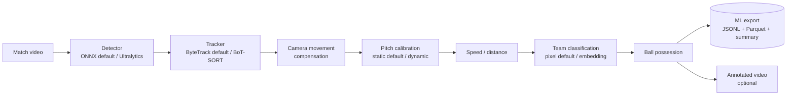

# Agon

*Agon* (ἀγών) — Greek for "contest" or "competition."

[](https://github.com/bradpatton/agon/actions/workflows/ci.yml)
[](LICENSE)
[](pyproject.toml)

Turns soccer match footage into structured, ML-ready tracking data: per-frame
player/referee/ball positions (pixel *and* pitch-space meters), team
assignment, ball possession, and speed/distance — exported as JSONL and
Parquet, not just an annotated video. An annotated video is still available
as an optional output, but the data is the point.

## What it does



Every stage marked "default / alternative" is swappable via config, behind a
`typing.Protocol` interface (see `src/agon/interfaces.py`) — no
pipeline code changes needed to pick a different backend. See
[Modernization & backend options](#modernization--backend-options) below for
what each alternative actually buys you and its real limitations.

## Install

```bash
git clone https://github.com/bradpatton/agon.git
cd agon
uv sync            # or: pip install -e .
```

Extras (none required for the default pipeline):

| Extra | Adds | Needed for |
|---|---|---|
| `[train]` | `torch`, `ultralytics`, `boxmot` | `UltralyticsDetector`, `BoTSORTTracker`, fine-tuning a checkpoint |
| `[assets]` | `gdown` | `scripts/download_assets.py` |
| `[dev]` | `pytest`, `ruff`, `mypy`, `pre-commit` | running tests/lint locally |

`torch` is deliberately not a core dependency — the default detector
(`OnnxDetector`, via `onnxruntime`) doesn't need it, and current `torch`
releases don't ship wheels for every platform (confirmed on Intel macOS
while building this). See [Modernization](#modernization--backend-options).

## Quickstart

```bash
# Fetch the tutorial's demo checkpoint + sample clip (or supply your own).
python scripts/download_assets.py

# The default backend runs on ONNX; export the downloaded .pt checkpoint once
# (needs the [train] extra just for this one-time conversion):
python -c "from ultralytics import YOLO; YOLO('models/best.pt').export(format='onnx', imgsz=640, dynamic=False)"

agon \
  --input input_videos/08fd33_4.mp4 \
  --model models/best.onnx \
  --calibration configs/calibration/example_pitch.json \
  --format jsonl --format parquet --format summary
```

Outputs land in `output/` by default (`--output-dir` to change it):
`<video>_frames.jsonl`, `<video>_frames.parquet`, `<video>_summary.json`. Add
`--format video` for an annotated `.mp4` alongside the data, `--format
schema` to also dump the JSON Schema. `--help` lists everything, including
`--cache` to reuse tracking results between runs while iterating.

`configs/calibration/example_pitch.json` is calibrated to the tutorial's one
sample camera angle — see [Pitch calibration](#pitch-calibration) before
pointing it at different footage.

## Output data schema

One record per frame, `schema_version`-stamped for forward compatibility
(`src/agon/export/schema.py` is the source of truth; a JSON
Schema is published via `--format schema`):

```json
{
  "schema_version": "1.0.0",
  "video_id": "08fd33_4",
  "frame_id": 142,
  "timestamp_s": 5.92,
  "camera_movement_px": [3.1, -0.4],
  "team_ball_control": 1,
  "objects": [
    {
      "track_id": 7,
      "class": "player",
      "team": 1,
      "bbox_px": [812.3, 401.1, 861.7, 512.4],
      "position_px": [837.0, 512.4],
      "position_pitch_m": [34.2, 12.8],
      "speed_kmh": 24.1,
      "distance_m": 812.4,
      "has_ball": true
    }
  ]
}
```

`class` is one of `player` / `goalkeeper` / `referee` / `ball`.
`position_pitch_m` is `null` when the point falls outside the calibrated
pitch area, or when the active `PitchCalibrator` had no usable reference in
that frame (see [Pitch calibration](#pitch-calibration)) — this is a real
"we don't know" signal, not a bug, and downstream ML code should treat it
that way rather than imputing a value. `<video>_summary.json` has
match-level aggregates (possession %, per-player total distance / avg / max
speed) built from the same data.

## Modernization & backend options

This started from a well-known YOLO+ByteTrack tutorial. Every algorithmic
choice was re-evaluated against current practice; some were upgraded, one
turned out to be a real accuracy bug rather than just dated. Priority order
below reflects how much each one matters, not the order they were built in.

### Pitch calibration

The highest-priority item, because it isn't just a modernization nice-to-have
— **a single static homography for an entire match is a real accuracy bug**.
Broadcast cameras pan/zoom continuously; the optical-flow camera-movement
compensation only corrects translation, not zoom/rotation, so pitch-space
positions silently drift wrong for most of the footage under `calibration_mode:
static` (the default, `ViewTransformer`).

`calibration_mode: dynamic` (`PitchKeypointCalibrator`) is a classical-CV
first cut at fixing this per-frame: it detects the pitch's center circle each
frame (its real-world 9.15m radius gives scale + position) and the halfway
line's angle (gives rotation). It is **not** a trained keypoint model and
**not** a full projective homography — read
`src/agon/geometry/pitch_keypoint_calibrator.py`'s module
docstring before trusting its output for anything beyond relative
speed/distance. It returns `null` positions for frames where it can't find
the circle (most of a real match), same as the static calibrator does
outside its polygon.

### Team classification

`team_classifier: pixel` (default, `TeamAssigner`) clusters raw jersey-crop
pixel colors — fragile under similar kit colors, lighting, and motion blur.
`team_classifier: embedding` (`EmbeddingTeamClassifier`) clusters small-CNN
embeddings instead (a MobileNetV3-Small backbone exported to ONNX via
`scripts/export_team_embedding_model.py`), which holds up meaningfully
better. Neither can separate "team" from "referee" without a soccer-specific
detector checkpoint with its own referee class.

### Tracking

`tracker_backend: bytetrack` (default, via `supervision`) is solid.
`tracker_backend: botsort` (`BoTSORTTracker`, via `boxmot`) adds a better
motion model and optional camera-motion compensation, at the cost of needing
the `[train]` extra — `boxmot` imports `torch` unconditionally, even in
motion-only mode (confirmed, not assumed).

### Inference backend

`OnnxDetector` (default, `onnxruntime`) vs. `UltralyticsDetector`
(`torch`/`ultralytics`, needs `[train]`). `torch` is unavoidable for
training/fine-tuning a checkpoint, but it's the wrong default dependency for
inference: it's heavy, and current releases don't have wheels for every
platform. `onnxruntime` is what Ultralytics itself recommends for
deployment. Export any checkpoint with `model.export(format="onnx",
imgsz=640, dynamic=False)`.

### Not yet done

- **Action/event recognition** (pass, shot, tackle). The export schema's
  `class` field and per-object structure are designed to extend to this
  later without a breaking change, but nothing is implemented yet. SoccerNet
  Action Spotting is the reference benchmark to build toward.
- **Learned pitch calibration.** A trained keypoint model (see Pitch
  calibration above) — training-data conversion scripts exist for two
  combined SoccerNet sources (`scripts/convert_soccernet_gsr_to_calibration.py`,
  `scripts/convert_soccernet_calibration_to_pixels.py`) but the model itself
  doesn't yet.
- **Jersey number recognition, inference side.** Training is fully built and
  validated (`scripts/train_jersey_classifier.py`, see
  [`docs/TRAINING.md`](docs/TRAINING.md)); the export schema has
  `jersey_number` ready to receive it, but no code path loads a trained
  classifier and calls it during a pipeline run yet.

## Training / fine-tuning

Fine-tuning the detector (and jersey number classifier) on real SoccerNet
data — deploying the `agon:train` Docker image to a separate GPU
machine, since training is CPU-impractical — is covered in
**[`docs/TRAINING.md`](docs/TRAINING.md)**, a quick copy-paste-able guide,
not this README. Short version: no GPU is needed to *develop against* this
project (this repo was built entirely without one), but a real training run
needs one; `docs/TRAINING.md` covers building the image, verifying the GPU
is actually visible before trusting anything else, pulling and preparing
the data, training, and deploying the resulting checkpoint back into the
main pipeline.

Training data comes from three combined SoccerNet sources, pulled and
converted by one command (`scripts/prepare_training_data.py`): **SN-GSR-2025**
(HuggingFace, no NDA — detection boxes, jersey numbers, pitch lines from a
curated game subset), and two legacy OwnCloud-hosted datasets that download
with SoccerNet's generic public password rather than an NDA-gated one —
**Calibration** (standalone pitch-line-annotated images, broader scene
diversity than GSR's video sequences) and **Jersey-2023** (richer,
tracklet-based jersey number data). All three land in the same output
directories regardless of source, so `train_detector.py` and
`train_jersey_classifier.py` need no changes to use them together.

## Configuration

`configs/default.yaml` sets `PipelineConfig` defaults (detection confidence,
speed-window size, `calibration_mode`, `team_classifier`, `tracker_backend`,
inference device, ...) — override with `--config your.yaml` or
`AGON_PIPELINE__<FIELD>` env vars. `configs/calibration/*.json` is
per-video/per-camera-angle: four pixel corner points + real pitch dimensions
(see `configs/calibration/example_pitch.json`'s comments for how to build
one for new footage).

## Development

```bash
uv sync --extra dev
pytest                              # 94 tests, pure logic + synthetic inputs, no video/model needed
ruff check src/ tests/ && ruff format --check src/ tests/
mypy src/agon
pre-commit install                  # run the above automatically on commit
```

The `[train]`-extra-dependent backends (`UltralyticsDetector`,
`BoTSORTTracker`) can't be exercised on every platform (see above) — the
`Dockerfile` exists specifically to validate them in a consistent Linux
environment:

```bash
docker build -t agon:train .
docker run --rm -v "$(pwd)/input_videos:/data/input_videos:ro" \
  -v "$(pwd)/models:/data/models:ro" -v "$(pwd)/configs:/data/configs:ro" \
  -v "$(pwd)/output:/data/output" -w /data agon:train \
  agon --input input_videos/your_clip.mp4 --model models/best.pt \
  --calibration configs/calibration/your_calibration.json
```

## Repo layout

```
src/agon/
  cli.py, pipeline.py       # entry point + orchestration
  detection/                # Detector backends + tracking assembly
  camera/                   # optical-flow camera-movement compensation
  geometry/                 # bbox math, pitch calibrators
  team/                     # team classifiers
  analytics/                # ball possession, speed/distance
  export/                   # versioned schema + JSONL/Parquet/summary writers
  viz/                      # annotated-video drawing
configs/                    # pipeline defaults + per-video pitch calibration
scripts/                    # asset download, team-embedding model export,
                             # SoccerNet download/convert/train (see docs/TRAINING.md)
notebooks/                  # training/exploration notebooks (not part of the pipeline)
tests/
```

## License & credits

MIT — see [LICENSE](LICENSE). This project restructures, hardens, and
extends a well-known public YOLO + ByteTrack + KMeans soccer-analysis
tutorial (detection/tracking/team-color/camera-compensation/homography/
speed-distance pipeline). If you recognize the original author or source
repo, please open a PR to add proper attribution here — it wasn't included
in the material this project started from.

If you use `scripts/download_assets.py`, note it fetches a third-party
checkpoint and sample clip from the original tutorial's hosting; verify
their license/provenance is appropriate for your use before relying on them
beyond experimentation.

Contributions welcome — see [CONTRIBUTING.md](CONTRIBUTING.md).
